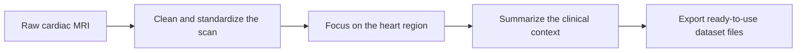
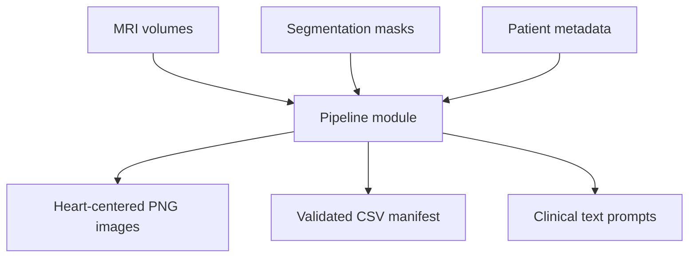
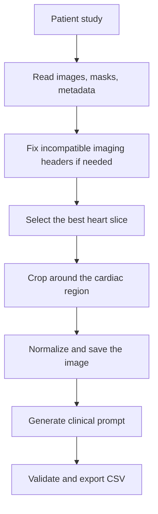
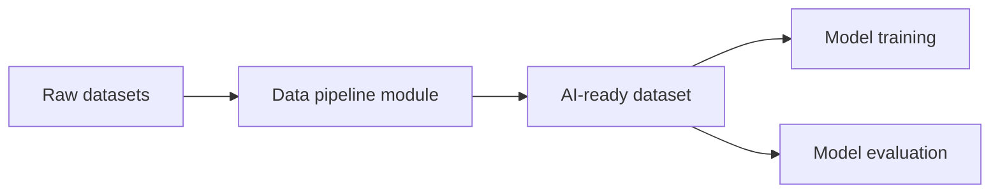

# Pipeline Overview

## What This Module Does

This module takes raw cardiac MRI studies and turns them into training-ready data for an AI system.

It produces two things:

- a clean image focused on the heart
- a short clinical text description attached to that image

Together, those outputs can be used to train or evaluate medical generative AI workflows.

## The Big Picture

## Input to Output

## Why It Exists

The raw medical data is not directly ready for AI training.

This pipeline solves that by making the dataset:

- consistent
- validated
- easier to reuse
- easier to scale to future datasets

## What Happens Inside

### 1. The data is loaded safely

The pipeline reads the original imaging files and checks for known formatting issues in the medical image headers before processing continues.

### 2. The scan is focused on the relevant anatomy

Instead of keeping the whole view, the pipeline finds the heart region using the mask and recenters the final image around it.

### 3. The image is standardized

Every processed image is resized and normalized so the final dataset has a uniform format.

### 4. The clinical context is converted into text

Patient metadata and heart-function information are turned into a short, stable text prompt.

### 5. The final dataset is validated

Before export, the pipeline checks that every row is complete and every referenced image exists.

## One-Page Flow

## What Comes Out

| Output | Meaning |
| --- | --- |
| `output/images/...png` | Clean heart-centered image |
| `output/csv/...csv` | Training manifest linking images and text |
| prompt text | Short medical description used by AI |

## Why This Matters

From a project point of view, this module turns scattered medical inputs into a reusable AI asset.

It gives the project:

- a repeatable preparation workflow
- a clear boundary between raw data and AI-ready data
- a foundation for future datasets beyond ACDC

## Current Scope

### Working now

- full pipeline for the ACDC dataset
- image preprocessing
- prompt generation
- CSV export
- patient-level dataset splitting

### Prepared for later

- support for additional datasets
- broader reuse in training and evaluation pipelines

## Module Position in the Project

## Stakeholder Summary

This module is the bridge between medical source data and AI development.

Without it, the project has raw files.
With it, the project has a structured dataset product.

That is why this pipeline can be treated as an independent section of the project: it has its own inputs, its own processing logic, its own validation rules, and its own outputs.
