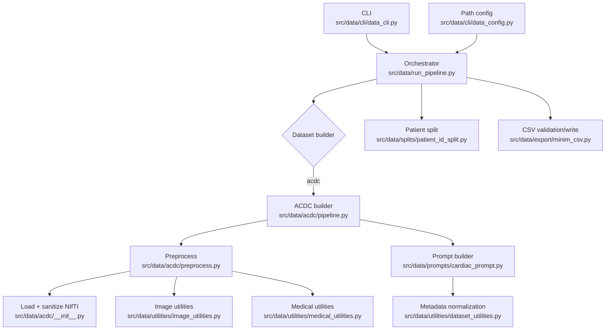
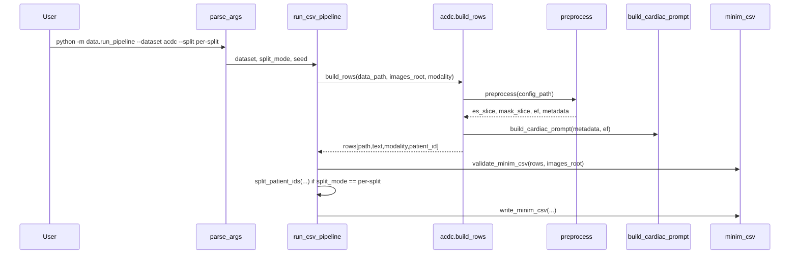

# Pipeline Technical Reference

## Purpose

This module converts raw cardiac MRI studies into a MINIM-compatible multimodal dataset:

- preprocessed 2D images in `output/images`
- validated CSV manifests in `output/csv`
- normalized clinical prompts for generative training

At the moment, `ACDC` is the only dataset implemented end to end. The orchestration layer is already structured so new datasets can be added as independent builders.

## Module Boundary

The data pipeline is a self-contained project section with four responsibilities:

1. Load and sanitize dataset-specific inputs.
2. Preprocess imaging data into a homogeneous 2D representation.
3. Build text prompts from canonical metadata.
4. Export validated MINIM rows and optional train/val/test splits.

Everything starts in [`src/data/run_pipeline.py`](/home/marc/Documentos/info2025.2026/tfg/TFG/src/data/run_pipeline.py).

## High-Level Architecture



## Execution Flow



## File Map

| File | Role |
| --- | --- |
| [`src/data/run_pipeline.py`](/home/marc/Documentos/info2025.2026/tfg/TFG/src/data/run_pipeline.py) | Top-level orchestration, builder dispatch, split mode, CSV writing |
| [`src/data/cli/data_cli.py`](/home/marc/Documentos/info2025.2026/tfg/TFG/src/data/cli/data_cli.py) | CLI argument parsing |
| [`src/data/acdc/__init__.py`](/home/marc/Documentos/info2025.2026/tfg/TFG/src/data/acdc/__init__.py) | Metadata loading, file-path resolution, NIfTI header sanitization, image loading |
| [`src/data/acdc/preprocess.py`](/home/marc/Documentos/info2025.2026/tfg/TFG/src/data/acdc/preprocess.py) | Dataset preprocessing pipeline |
| [`src/data/acdc/pipeline.py`](/home/marc/Documentos/info2025.2026/tfg/TFG/src/data/acdc/pipeline.py) | Case discovery, PNG saving, overlay saving, row construction |
| [`src/data/prompts/cardiac_prompt.py`](/home/marc/Documentos/info2025.2026/tfg/TFG/src/data/prompts/cardiac_prompt.py) | Text prompt generation from metadata + EF |
| [`src/data/utilities/image_utilities.py`](/home/marc/Documentos/info2025.2026/tfg/TFG/src/data/utilities/image_utilities.py) | Slice extraction, resampling, ROI crop, resizing, normalization |
| [`src/data/utilities/medical_utilities.py`](/home/marc/Documentos/info2025.2026/tfg/TFG/src/data/utilities/medical_utilities.py) | LV volume and EF computation |
| [`src/data/export/minim_csv.py`](/home/marc/Documentos/info2025.2026/tfg/TFG/src/data/export/minim_csv.py) | MINIM row validation and CSV export |
| [`src/data/splits/patient_id_split.py`](/home/marc/Documentos/info2025.2026/tfg/TFG/src/data/splits/patient_id_split.py) | Reproducible patient-level splits |

## Real ACDC Pipeline

### Input Contract

For each patient, the ACDC loader expects:

- one `*.cfg` file with metadata
- one `*_4d.nii.gz`
- ED image and mask
- ES image and mask

The metadata loader extracts:

- `pid`
- `pathology`
- `height`
- `weight`
- `n_frames`
- `ed_frame`
- `es_frame`

### Preprocessing Steps

The current preprocessing logic in [`src/data/acdc/preprocess.py`](/home/marc/Documentos/info2025.2026/tfg/TFG/src/data/acdc/preprocess.py#L24) is:

```mermaid
flowchart LR
    CFG["patient*.cfg"] --> META["load_metadata(...)"]
    META --> LOAD["load_data(...)"]
    LOAD --> SAN["sanitize malformed NIfTI headers if needed"]
    SAN --> LABELS["ChangeLabel(...) to RV=1, MYO=2, LV=3"]
    LABELS --> SLICE["select_mask_slice(es_mask)"]
    SLICE --> EXTRACT["extract_slice(es_image, es_mask, slice_idx)"]
    EXTRACT --> RES["resample_slice(..., 1.0 x 1.0 mm)"]
    RES --> CENTER["get_lv_center(mask_slice)"]
    CENTER --> SIZE["get_mask_crop_size(mask_slice)"]
    SIZE --> CROP["crop_around_center(...)"]
    CROP --> RESIZE["resize_slice(..., 512 x 512)"]
    RESIZE --> NORM["normalize(image)"]
    LABELS --> EF["compute_ef(ed_mask, es_mask)"]
```



### Why the NIfTI Sanitization Exists

The loader in [`src/data/acdc/__init__.py`](/home/marc/Documentos/info2025.2026/tfg/TFG/src/data/acdc/__init__.py#L42) fixes malformed ACDC headers before `SimpleITK` reads them.

Problem it solves:

- some ACDC files contain `pixdim` values that disagree with `sform` scaling
- `SimpleITK` warns at read time with `unexpected scales in sform`
- the pipeline now rewrites only the affine metadata into a cached sanitized copy when that inconsistency is detected

This is a data-ingestion correction, not a warning-suppression workaround.

### Output of `preprocess(...)`

`preprocess(...)` returns:

```python
(es_slice, mask_slice, ef, metadata)
```

Where:

- `es_slice` is 2D, cropped around the cardiac region, resized to `512 x 512`, and normalized to `[0, 1]`
- `mask_slice` is the aligned 2D mask after the same geometric operations
- `ef` is the LV ejection fraction
- `metadata` is the canonical per-patient metadata dictionary

## Builder Contract

The orchestrator expects dataset builders with this conceptual signature:

```python
build_rows(data_path: Path, images_root: Path, modality: str) -> list[dict[str, str]]
```

Each row must carry:

- `path`
- `text`
- `modality`
- `patient_id`

`patient_id` is required internally for split generation but is not part of the final MINIM CSV because the CSV writer ignores extra keys.

## ACDC Builder Details

The builder in [`src/data/acdc/pipeline.py`](/home/marc/Documentos/info2025.2026/tfg/TFG/src/data/acdc/pipeline.py#L69) does the following per case:

1. Discover patient config files.
2. Call `preprocess(config_path)`.
3. Save the processed image as `output/images/acdc/<patient>_es_mid.png`.
4. Save a mask overlay image under `output/images/acdc/maksed/`.
5. Build a prompt from metadata and EF.
6. Return a row with `path`, `text`, `modality`, and `patient_id`.

Note:

- the filename still contains `_es_mid`, but the slice is no longer the geometric middle slice; it is now the slice selected from the mask footprint
- the overlay folder is currently named `maksed` in code and reflects the real implementation state

## Prompt Semantics

[`src/data/prompts/cardiac_prompt.py`](/home/marc/Documentos/info2025.2026/tfg/TFG/src/data/prompts/cardiac_prompt.py#L31) builds a compact prompt with three normalized components:

- BMI group
- pathology label
- EF category

Current prompt shape:

```text
Cardiac MRI, short-axis view, <bmi_group>, <pathology> condition, <ef_category>.
```

Example:

```text
Cardiac MRI, short-axis view, overweight, dilated cardiomyopathy condition, reduced EF.
```

## CSV Export Contract

[`src/data/export/minim_csv.py`](/home/marc/Documentos/info2025.2026/tfg/TFG/src/data/export/minim_csv.py#L10) enforces a minimal schema:

```text
path,text,modality
```

Validation checks:

- all required columns are present
- `path`, `text`, and `modality` are non-empty
- `path` is unique across rows
- `images_root / path` exists on disk

## Split Strategy

If `--split per-split` is selected, [`src/data/run_pipeline.py`](/home/marc/Documentos/info2025.2026/tfg/TFG/src/data/run_pipeline.py#L28) partitions at patient level, not image level.

This avoids train/validation/test leakage across slices or derived artifacts from the same patient.

## Operational Notes

### What Is Implemented

- `acdc` builder is registered and working
- MINIM CSV export is working
- patient-level split mode is working
- preprocessing focuses on the cardiac ROI rather than the geometric middle slice
- malformed ACDC NIfTI headers are corrected during loading

### What Is Not Implemented

- `ukbb` is still offered in the CLI choices but is not registered in `DATASET_BUILDERS`
- no explicit typed row model is defined yet
- no formal dataset plugin interface exists beyond the builder convention

## Guidance for Agentic AI

If you extend this module, the safe insertion points are:

1. Add a new package under `src/data/<dataset>/`.
2. Implement dataset-specific load/preprocess/build logic there.
3. Reuse shared utilities when semantics match.
4. Register the builder in `DATASET_BUILDERS`.
5. Preserve the row contract expected by CSV export and split logic.

Do not:

- hardcode dataset-specific rules in `run_pipeline.py`
- remove `patient_id` before split generation
- bypass `validate_minim_csv(...)`
- duplicate prompt semantics if `dataset_utilities.py` already covers them

## Guidance for Developers

The clean architectural boundary is:

- orchestration in `run_pipeline.py`
- dataset-specific logic in `src/data/<dataset>/`
- reusable medical/image helpers in `src/data/utilities/`
- export contract in `src/data/export/`

That boundary is the key reason this pipeline can be treated as an independent project module.
